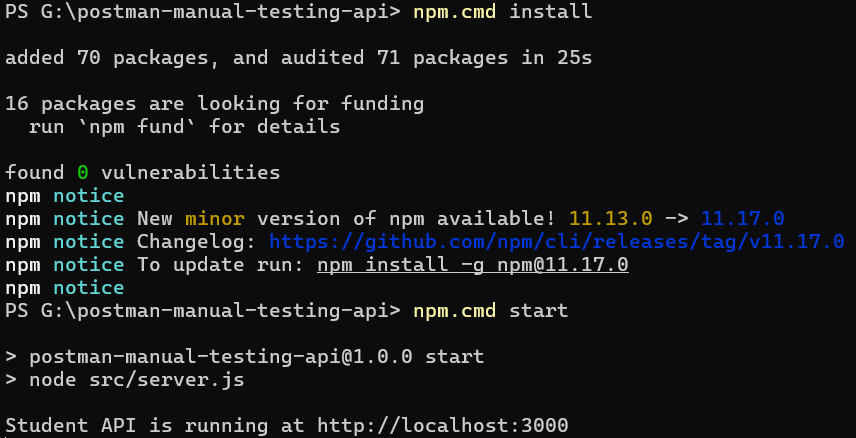
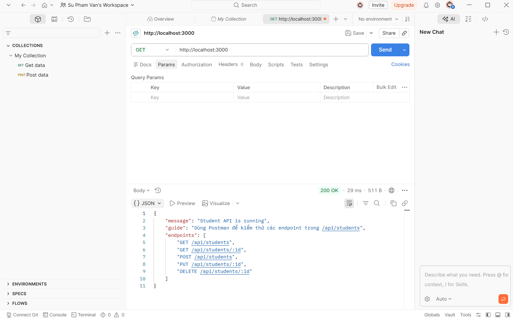
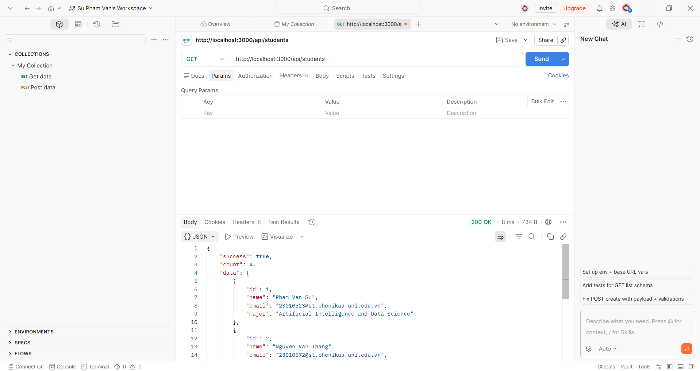
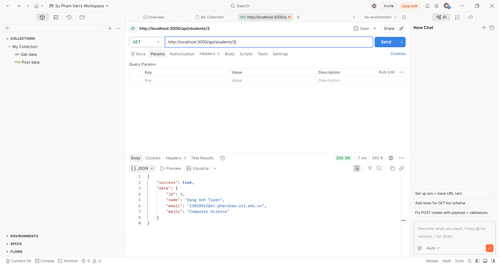
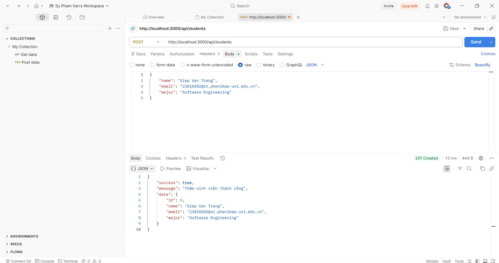
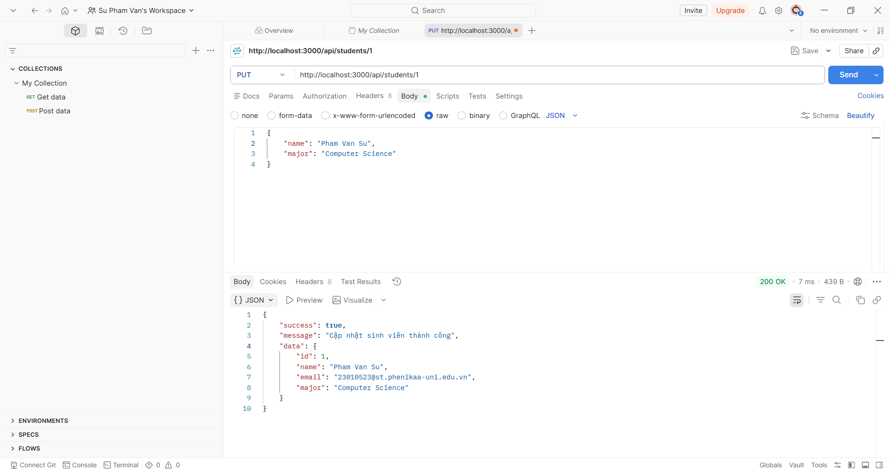
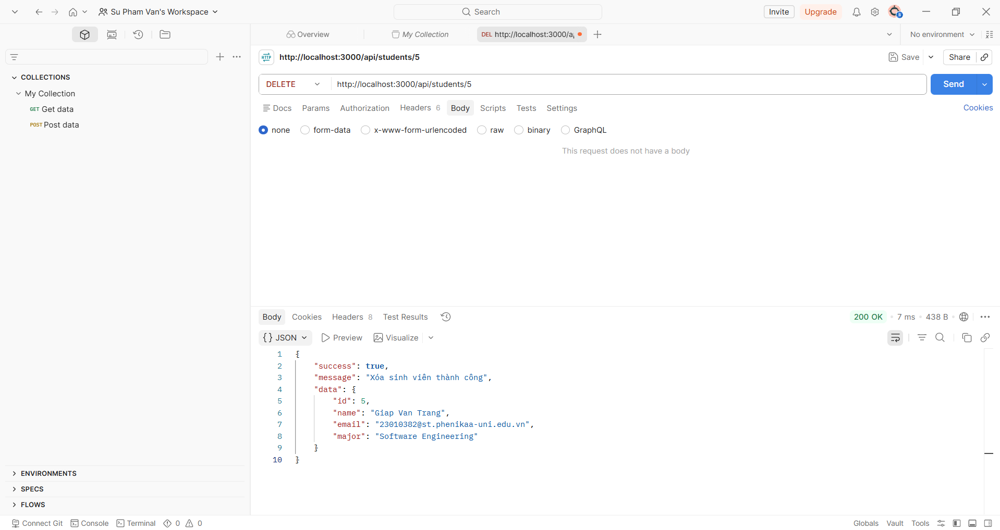
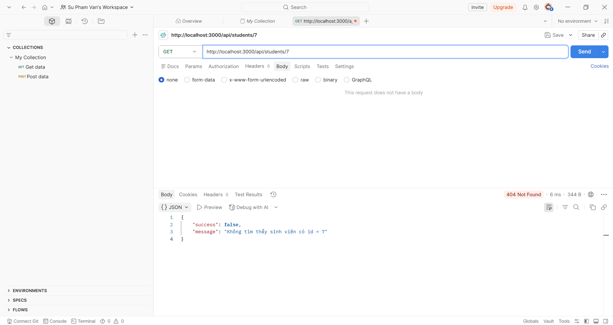
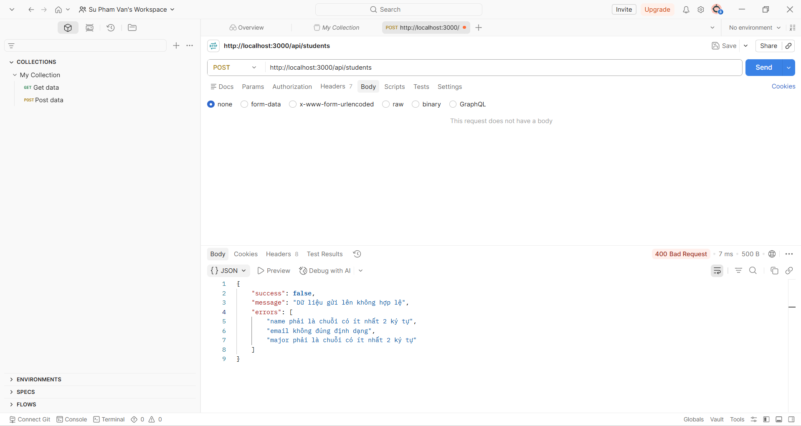

# Báo cáo sản phẩm: Kiểm thử API bằng Postman

## 1. Thông tin bài làm

- **Tên sản phẩm:** Student API - Kiểm thử thủ công bằng Postman
- **Công cụ kiểm thử:** Postman
- **Ngôn ngữ lập trình:** JavaScript
- **Framework:** Node.js + Express.js
- **Mục tiêu:** Xây dựng một REST API đơn giản và sử dụng Postman để kiểm thử các chức năng cơ bản như `GET`, `POST`, `PUT`, `DELETE`.

---

## 2. Giới thiệu Postman

Postman là công cụ hỗ trợ gửi request đến API và quan sát kết quả trả về từ server. Khi kiểm thử API bằng Postman, người dùng có thể:

- Chọn phương thức HTTP như `GET`, `POST`, `PUT`, `DELETE`.
- Nhập URL endpoint cần kiểm thử.
- Thiết lập `Headers`, ví dụ `Content-Type: application/json`.
- Nhập dữ liệu gửi lên trong phần `Body`.
- Xem kết quả trả về gồm `Status Code`, `Response Body`, thời gian phản hồi và kích thước dữ liệu.

Trong bài này, Postman được dùng để kiểm thử thủ công các chức năng của API quản lý sinh viên.

---

## 3. Mô tả source code

Source code xây dựng một API quản lý sinh viên đơn giản. Dữ liệu được lưu tạm trong mảng JavaScript, không sử dụng database để bài làm dễ chạy và dễ kiểm thử.

### 3.1. Cấu trúc thư mục

```text
postman-manual-testing-api/
├── src/
│   └── server.js
├── postman/
│   ├── Postman_Manual_Testing_Collection.json
│   └── Postman_Local_Environment.json
├── docs/
│   └── screenshots/
├── package.json
└── README.md
```

### 3.2. Các endpoint chính

| STT | Method | Endpoint | Chức năng | Kết quả mong đợi |
|---|---|---|---|---|
| 1 | GET | `/` | Kiểm tra server đang chạy | 200 OK |
| 2 | GET | `/api/students` | Lấy danh sách sinh viên | 200 OK |
| 3 | GET | `/api/students/:id` | Lấy sinh viên theo id | 200 OK hoặc 404 Not Found |
| 4 | POST | `/api/students` | Thêm sinh viên mới | 201 Created |
| 5 | PUT | `/api/students/:id` | Cập nhật thông tin sinh viên | 200 OK |
| 6 | DELETE | `/api/students/:id` | Xóa sinh viên | 200 OK |
| 7 | POST | `/api/students` | Gửi body sai để kiểm thử lỗi | 400 Bad Request |

---

## 4. Hướng dẫn chạy chương trình

### Bước 1: Cài đặt Node.js

Kiểm tra Node.js đã được cài đặt hay chưa:

```bash
node -v
npm -v
```

### Bước 2: Cài thư viện

Tại thư mục gốc của project, chạy lệnh:

```bash
npm install
```

### Bước 3: Chạy server

```bash
npm start
```

Nếu chạy thành công, terminal sẽ hiển thị:

```bash
Student API is running at http://localhost:3000
```



---

## 5. Quy trình kiểm thử bằng Postman

### 5.1. Tạo request kiểm tra server

- Method: `GET`
- URL: `http://localhost:3000/`
- Nhấn **Send**

Kết quả mong đợi:

- Status: `200 OK`
- Body trả về thông báo server đang chạy.



---

### 5.2. Kiểm thử lấy danh sách sinh viên

- Method: `GET`
- URL: `http://localhost:3000/api/students`
- Nhấn **Send**

Kết quả mong đợi:

- Status: `200 OK`
- Response body có trường `success: true`
- Dữ liệu trả về là danh sách sinh viên.

Ví dụ response:

```json
{
  "success": true,
  "count": 2,
  "data": [
    {
      "id": 1,
      "name": "Pham Van Su",
      "email": "23010523@st.phenikaa-uni.edu.vn",
      "major": "Artificial Intelligence and Data Science"
    }
  ]
}
```



---

### 5.3. Kiểm thử lấy sinh viên theo id

- Method: `GET`
- URL: `http://localhost:3000/api/students/1`
- Nhấn **Send**

Kết quả mong đợi:

- Status: `200 OK`
- Body trả về thông tin sinh viên có `id = 1`.



---

### 5.4. Kiểm thử thêm sinh viên mới

- Method: `POST`
- URL: `http://localhost:3000/api/students`
- Tab **Headers**:

| Key | Value |
|---|---|
| Content-Type | application/json |

- Tab **Body** chọn `raw` và chọn định dạng `JSON`.

Body gửi lên:

```json
{
  "name": "Tran Thi B",
  "email": "tranthib@example.com",
  "major": "Software Engineering"
}
```

Kết quả mong đợi:

- Status: `201 Created`
- Body có thông báo thêm sinh viên thành công.
- Dữ liệu trả về có thêm trường `id`.



---

### 5.5. Kiểm thử cập nhật sinh viên

- Method: `PUT`
- URL: `http://localhost:3000/api/students/1`
- Header: `Content-Type: application/json`
- Body:

```json
{
  "name": "Pham Van Su Updated",
  "major": "AI and Data Science"
}
```

Kết quả mong đợi:

- Status: `200 OK`
- Body có thông báo cập nhật thành công.
- Dữ liệu của sinh viên được thay đổi theo body gửi lên.



---

### 5.6. Kiểm thử xóa sinh viên

- Method: `DELETE`
- URL: `http://localhost:3000/api/students/2`
- Nhấn **Send**

Kết quả mong đợi:

- Status: `200 OK`
- Body có thông báo xóa sinh viên thành công.



---

### 5.7. Kiểm thử trường hợp lỗi không tìm thấy dữ liệu

- Method: `GET`
- URL: `http://localhost:3000/api/students/999`
- Nhấn **Send**

Kết quả mong đợi:

- Status: `404 Not Found`
- Body trả về thông báo không tìm thấy sinh viên.



---

### 5.8. Kiểm thử trường hợp gửi body không hợp lệ

- Method: `POST`
- URL: `http://localhost:3000/api/students`
- Header: `Content-Type: application/json`
- Body:

```json
{
  "name": "A",
  "email": "email-sai",
  "major": ""
}
```

Kết quả mong đợi:

- Status: `400 Bad Request`
- Body trả về danh sách lỗi dữ liệu.



---

## 6. Bảng tổng hợp test case

| Mã TC | Chức năng | Method | URL | Dữ liệu đầu vào | Kết quả mong đợi | Trạng thái |
|---|---|---|---|---|---|---|
| TC01 | Kiểm tra server | GET | `/` | Không có | 200 OK | Đạt |
| TC02 | Lấy danh sách sinh viên | GET | `/api/students` | Không có | 200 OK | Đạt |
| TC03 | Lấy sinh viên theo id hợp lệ | GET | `/api/students/1` | Không có | 200 OK | Đạt |
| TC04 | Thêm sinh viên hợp lệ | POST | `/api/students` | JSON hợp lệ | 201 Created | Đạt |
| TC05 | Cập nhật sinh viên | PUT | `/api/students/1` | JSON cập nhật | 200 OK | Đạt |
| TC06 | Xóa sinh viên | DELETE | `/api/students/2` | Không có | 200 OK | Đạt |
| TC07 | Lấy sinh viên không tồn tại | GET | `/api/students/999` | Không có | 404 Not Found | Đạt |
| TC08 | Thêm sinh viên với body sai | POST | `/api/students` | JSON không hợp lệ | 400 Bad Request | Đạt |

---

## 7. Import collection vào Postman

Ngoài cách tự tạo request thủ công, project có sẵn collection để mở nhanh trong Postman.

Các bước thực hiện:

1. Mở Postman.
2. Chọn **Import**.
3. Chọn file `postman/Postman_Manual_Testing_Collection.json`.
4. Chọn thêm file `postman/Postman_Local_Environment.json` nếu muốn dùng biến `baseUrl`.
5. Chọn environment `Student API Local Environment`.
6. Chạy từng request và quan sát kết quả.

---

## 8. Nhận xét kết quả

Qua quá trình kiểm thử bằng Postman, các chức năng chính của API đều hoạt động đúng theo yêu cầu. Các request hợp lệ trả về status code thành công như `200 OK` hoặc `201 Created`. Các trường hợp lỗi như tìm sinh viên không tồn tại hoặc gửi dữ liệu không hợp lệ cũng được xử lý và trả về status code phù hợp như `404 Not Found` và `400 Bad Request`.

Việc sử dụng Postman giúp quá trình kiểm thử API trực quan hơn vì có thể quan sát trực tiếp request, response body, status code và thời gian phản hồi. Đây là công cụ phù hợp để kiểm thử API trong giai đoạn phát triển phần mềm.

---

## 9. Kết luận

Bài thực hành đã xây dựng được một REST API đơn giản và thực hiện kiểm thử bằng Postman theo các thao tác cơ bản. Thông qua bài làm, sinh viên nắm được cách gửi request, cấu hình header/body, kiểm tra response và ghi nhận kết quả kiểm thử.

Các nội dung đã thực hiện:

- Xây dựng API quản lý sinh viên bằng Node.js và Express.
- Kiểm thử các method `GET`, `POST`, `PUT`, `DELETE` bằng Postman.
- Kiểm tra các response thành công và response lỗi.
- Lập bảng test case và ghi nhận kết quả.
- Chuẩn bị collection Postman để thuận tiện cho việc kiểm thử lại.
